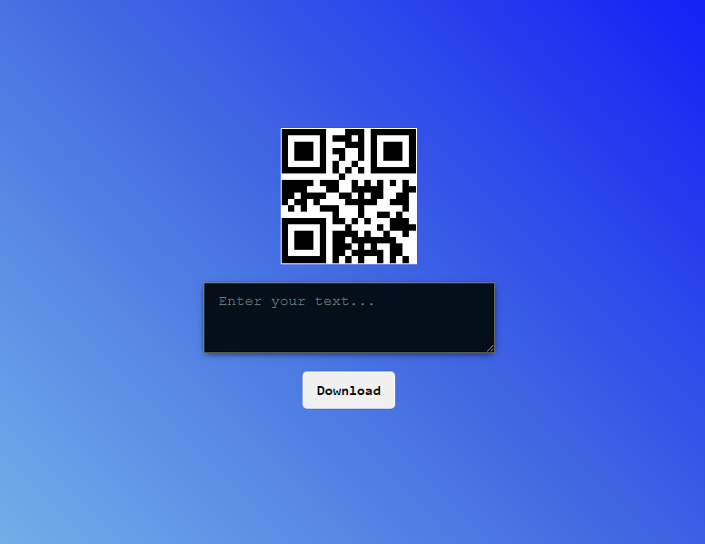

# QR Code Generator

## Overview
 This QR Code Generator Web App is very useful. You can convert your information
 to the form of qr code and you can also download generated qr in your local device.

 
### Screenshots

  

### Links

- Live Site URL: [See Website](https://qr-cod.netlify.app/)

## My process

### Built with

- HTML5 
- CSS 
- Flexbox
- API
- File Saver functions

### What I learned
- How to work with API.
- How to save qr code file in local device

## Author

- Website - [Sagar Sharma](https://sagar-io.github.io/)
